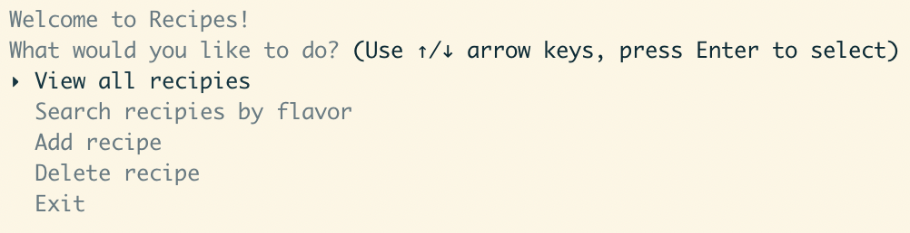
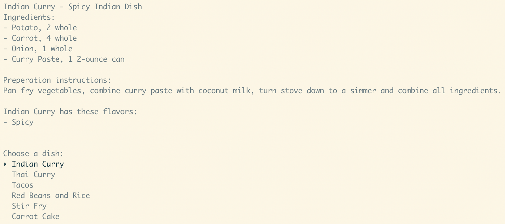
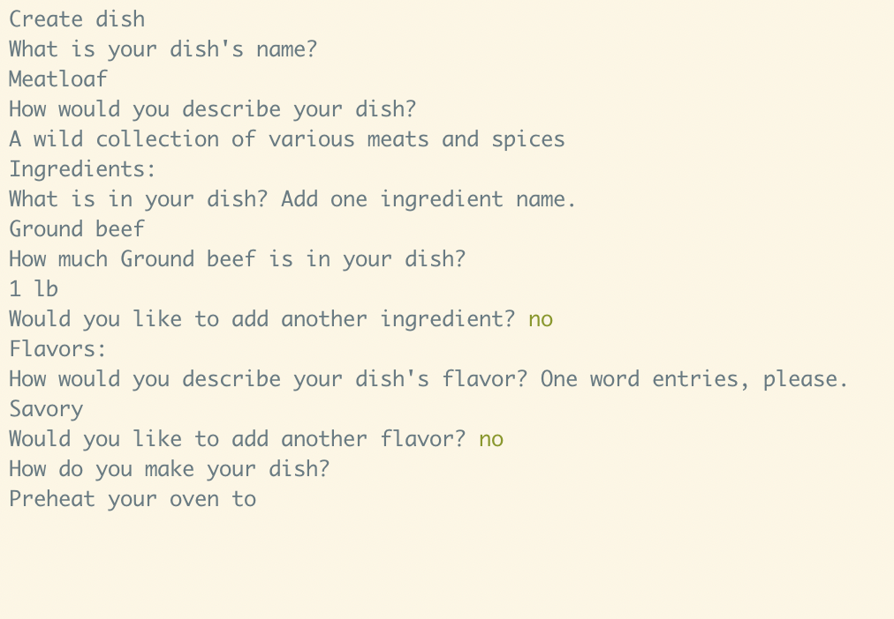
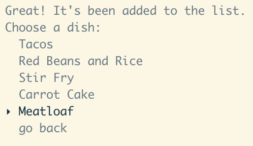

<!-- 
Scope of functionalities 

Sources
-->

# Recipes 
A simple Ruby application for storing recipes. 
## Table of Contents 
[Introduction](#introduction)   
[Technologies](#technologies)   
[Launch](#launch)   
[Example of Use](#example_of_use)   
[Project Status](#project_status)   
[Sources](#sources)


## Introduction 
This simple application was created to demonstrate my knowledge of object oriented programming and database management using Ruby and ActiveRecord. The application is meant to hold recipes entered by the user. The recipes are organized by their name and flavors. Users can view all recipes or search for recipes by recipe flavors. The user is also able to add or delete recipes. 

## Technologies
- [Ruby 2.6](https://www.ruby-lang.org/en/)
- [TTY::Prompt 0.20](https://github.com/piotrmurach/tty-prompt)
- [ActiveRecord 5.2](https://rubyonrails.org/)
- [Pry 0.12.2](https://github.com/pry/pry)

## Launch
From the main directory, first install all necessary dependencies: 
```ruby 
bundle install 
``` 
Then run the application from the same directory with : 
```ruby 
ruby bin/run.rb
``` 

## Example of Use 
The main menu: 



Viewing recipes: 



Adding a recipe: 



After saving the dish it is added to the recipe list: 




## Project Status 
The project is usable and in working order. Suggestions have been made to spruce up the project with ASCII art and a login page, which I am considering for the future. I am also considering restructuring the interface to make the user experience more pleasant. For instance, I am curious if it would be better for the user to pick a recipe from a list, then be presented the option to edit or delete that recipe. If a login feature were to been implemented, then the user could add a recipe they are viewing to their favorite recipes. This would remove the 'delete recipe' option from the main menu and make the application more useable. 

## Sources 

This application was forked from [this](https://github.com/learn-co-students/ruby-project-alt-guidelines-atlanta-web-010620) project skeleton provided by Flatiron. All Ruby files were written by Tyler Greason except for environment.rb and rakefile.rb. 